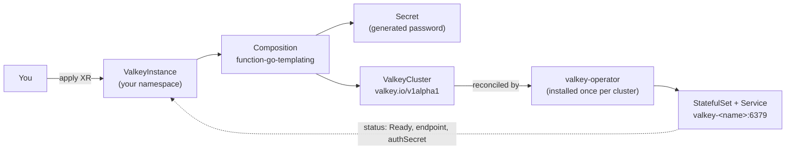

# template-valkey

Self-service **Valkey** (Redis-compatible in-memory store) for the Open Service
Portal, built on the official [`valkey-io/valkey-operator`](https://github.com/valkey-io/valkey-operator)
and exposed as a namespaced Crossplane v2 XR.

Spec & design: [valkey-service.md](https://github.com/open-service-portal/portal-workspace/blob/main/docs/specs/valkey-service.md) ·
spike findings: [valkey-spike-findings.md](https://github.com/open-service-portal/portal-workspace/blob/main/docs/specs/valkey-spike-findings.md).

---

## Order a Valkey instance

Apply a `ValkeyInstance` into your namespace (Crossplane v2 — a direct XR, no claim):

```yaml
# my-cache.yaml
apiVersion: openportal.dev/v1alpha1
kind: ValkeyInstance
metadata:
  name: my-cache
  namespace: my-team        # your namespace
spec:
  size: small               # small | medium | large
  persistence:
    enabled: false          # true + size for durable storage
```

```sh
kubectl apply -f my-cache.yaml
```

That's the whole order. The platform creates a running, **password-protected**
Valkey for you and reports back on the resource's status.

> In the portal, the same thing is offered as a form in the software catalog
> (the template is registered there); under the hood it creates this exact XR.

### Parameters

| Field | Values | Default | Effect |
|---|---|---|---|
| `size` | `small` \| `medium` \| `large` | `small` | CPU/memory of the Valkey pod |
| `persistence.enabled` | `bool` | `false` | attach a PVC so data survives pod restarts (otherwise in-memory only) |
| `persistence.size` | quantity (e.g. `5Gi`) | `1Gi` | PVC size when persistence is enabled |
| `observability.webUI` | `bool` | `true` | deploy a per-instance Valkey Admin web UI (see [Observe](#observe-web-ui)); set `false` to opt out |

Size → resources:

| size | cpu req | mem req | mem limit |
|---|---|---|---|
| small | 50m | 128Mi | 256Mi |
| medium | 250m | 512Mi | 1Gi |
| large | 500m | 1Gi | 2Gi |

Auth, TLS, replicas and sharding are not exposed in the MVP (the XRD is designed
to add them later without breaking changes).

## Check status

```sh
kubectl get valkeyinstance my-cache -n my-team
```

```
NAME       SIZE    READY   ENDPOINT
my-cache   small   True    valkey-my-cache.my-team.svc.cluster.local:6379
```

`READY=True` means it's ready to use. Two fields on the status carry everything
you need to connect:

- `status.endpoint` — the in-cluster address, `host:6379`
- `status.authSecret` — the Secret holding the password (key `password`)

```sh
kubectl get valkeyinstance my-cache -n my-team -o jsonpath='{.status.endpoint}'
kubectl get secret my-cache-auth -n my-team -o jsonpath='{.data.password}' | base64 -d
```

## Connect

Authenticate as the Valkey **`default`** user with that password.

From an app, use the endpoint host/port and the password from the Secret
(mount/reference `my-cache-auth`, key `password`). Quick check with `valkey-cli`:

```sh
PW=$(kubectl get secret my-cache-auth -n my-team -o jsonpath='{.data.password}' | base64 -d)
# from a pod that can reach the service:
valkey-cli -h valkey-my-cache.my-team.svc.cluster.local -p 6379 -a "$PW" ping   # -> PONG
```

Without the password you get `NOAUTH Authentication required` — auth is enforced.

> **Cluster mode:** the operator always runs Valkey in cluster mode (a single
> node owns all 16384 hash slots). Use a Valkey/Redis client that supports
> cluster mode, or point it at the single node directly.

## Observe (web UI)

Every instance ships with a **[Valkey Admin](https://valkey-admin.valkey.io/) web UI**
(`spec.observability.webUI`, default `true`) — a `<name>-admin` Deployment + Service in
the same namespace, wired to your instance's host. It gives you cluster topology, a
key browser, and an interactive console. You supply the `default` user's password
once when you connect (get it from the Secret — see [Connect](#connect)).

Browser access needs HTTPS: the Valkey Admin app sends `Strict-Transport-Security`
(HSTS), so a plain `http://` port-forward loads a blank page (assets get upgraded to
`https://` and fail). Expose it over HTTPS through the platform's Gateway API
`ExposedService` (a per-instance `<name>.<baseDomain>` with a wildcard cert). A
port-forward is still fine for API/`curl` checks:

```sh
kubectl port-forward svc/my-cache-admin -n my-team 8080:8080   # API/curl only, not a browser
```

Connecting in the UI (**Add Connection**):

- **Endpoint Type: `Node`** — point at the single node. Do **not** use `Discovery`:
  cluster discovery targets the node's announced pod IP and times out.
- **Host / Port:** from `status.endpoint` (e.g. `valkey-my-cache.my-team.svc.cluster.local` / `6379`).
- **Auth: Password**, username `default`, password from the Secret (see [Connect](#connect)).
- **Untick `Use TLS` and `Verify TLS Certificate`** — both default to on, but the
  instance speaks plaintext on `6379`, so leaving them on fails the TLS handshake.

Set `observability.webUI: false` to skip it for a headless instance.

> **Metrics/Activity need a separate sidecar.** The dashboard's CPU/memory metrics and
> the Activity/Hot-Keys views come from the upstream Valkey Admin *metrics sidecar*
> (one per Valkey pod), which is **not** deployed here — its image is not yet published
> upstream ([valkey-admin#382](https://github.com/valkey-io/valkey-admin/issues/382)).
> **Connect, cluster topology, and the key browser work from the app's own connection**;
> the metrics-backed panels will populate once the sidecar is deployed. (Tracked as a follow-up.)

## Remove

Delete the XR — Crossplane cascades the cleanup (ValkeyCluster, pods, the
generated Secret, and the PVC if any):

```sh
kubectl delete valkeyinstance my-cache -n my-team
```

> With `persistence.enabled: true`, deleting removes the PVC and its data. Back
> up first if you need to keep it.

---

## How it works



The Composition renders a password `Secret` and a `ValkeyCluster`
(`shards:1, replicas:0`), applied via provider-kubernetes; the operator turns
that into a running, password-protected Valkey. The operator itself is platform
infrastructure, installed once per cluster (not by this template).

## Requirements

- A cluster set up by `portal-workspace/scripts/cluster-setup.sh` (Crossplane
  v2, provider-kubernetes, functions, and the Valkey operator).
- **Valkey operator ≥ #235** (probes authenticate as the `_operator` system
  user). On the released v0.2.0, password-protecting the `default` user breaks
  cluster formation, so `cluster-setup.sh` builds the operator from a pinned
  commit. See the spike findings for details.

## Layout

```
configuration/
  crossplane.yaml    # Configuration package metadata
  xrd.yaml           # ValkeyInstance API (XRD, v2, namespaced)
  composition.yaml   # Pipeline: go-templating -> provider-kubernetes -> auto-ready
  rbac.yaml          # provider-kubernetes RBAC for valkey.io + secrets
example/
  xr.yaml            # example orders
.github/workflows/
  release.yaml       # tag v* -> build & push the Configuration package to ghcr
```

Released as `ghcr.io/open-service-portal/configuration-valkey` and registered in
the [catalog](https://github.com/open-service-portal/catalog) for GitOps delivery.
